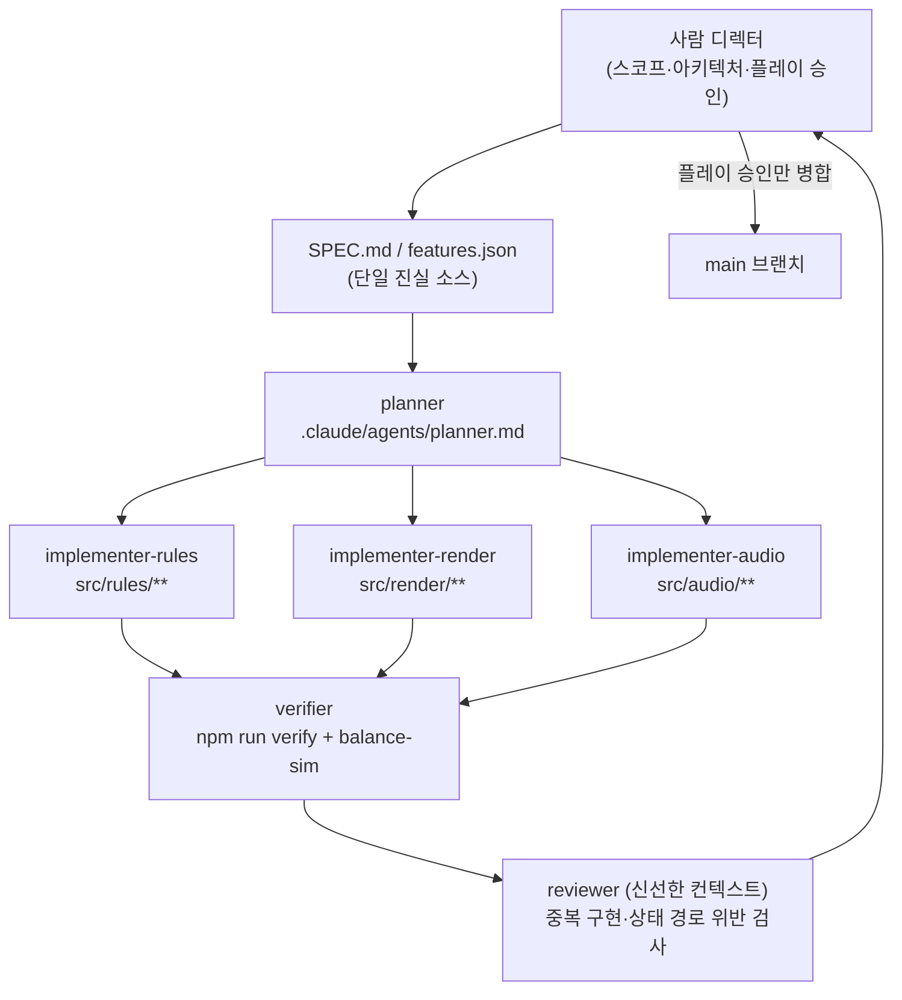

# 7일 스코프 관리와 AI 에이전트 풀가동 개발 프로세스 — 근거 조사

조사일: 2026-07-28 / 대상: NHN NAN 2026 사전과제(마감 2026-08-10)

---

## 0. 결론 먼저 (10줄)

1. 잼 postmortem에서 완주한 팀의 공통점은 "네트워크·절차생성·커스텀 아트"를 **첫 1~2일 안에** 잘랐다는 것이다. 마지막에 자른 팀은 마감 38분 전에 제출했다.
2. 레벨을 늘린 것이 가장 흔한 후회다. GMTK 상위 20 입상자조차 "15개 말고 5~8개를 더 다듬었어야 했다"고 적었다.
3. 튜토리얼은 분량이 아니라 **전달 타이밍**에서 실패한다. 텍스트 패널은 다른 이벤트에 묻혀 안 읽힌다.
4. 밸런싱이 마지막에 폭발하는 이유는 "밸런싱은 코드가 다 붙은 뒤에만 측정 가능한 유일한 작업"이기 때문이다. 앞당길 수 없고, 대신 **측정을 자동화**해야 한다.
5. AI 에이전트의 최악 실패 모드는 버그가 아니라 **"테스트 초록불 + 게임 플레이 불가"**다. 실측 증상: 60초 동안 데미지 0, 레벨업 간격 3.9초(목표 10~30초).
6. AI 에이전트는 컴파일 통과율은 올리지만 **런타임 행동 품질은 못 올린다**. JAMER 논문 결론: 병목은 문법이 아니라 아키텍처 설계.
7. 컨텍스트 붕괴는 한계 근처가 아니라 **전 구간에서 점진적으로** 일어난다(모델 18종 실측). "아직 여유 있으니 괜찮다"는 잘못된 가정이다.
8. 세션이 바뀌면 에이전트는 아키텍처 감각을 못 이어받아 **같은 동작의 변종 함수를 4개** 만든다. 실측 사례: 3시간 구축 → 3일 밤 디버깅, 동기화 계층 800줄 3회 재작성.
9. AI가 항상 빠르지도 않다. 숙련 개발자 RCT에서 **19% 느려졌고 본인들은 20% 빨라졌다고 착각**했다. 따라서 문서에는 체감이 아니라 커밋 타임스탬프 실측치를 써야 한다.
10. 심사에 강한 증거물은 "잘 만든 PDF"가 아니라 **재현 가능한 흔적**이다: features.json, progress 로그, .claude/agents 정의, 훅 스크립트, verify 명령, 커밋 로그, 폐기된 프롬프트.

---

## 1. 게임잼 postmortem: 무엇을 잘랐더니 살았나

### 1-1. 절단 사례 표

| 사례 | 자른 것 | 언제 | 결과 |
|---|---|---|---|
| Survive Another Night (7일 잼) | PC 간 멀티플레이 | Day 1~2 (1.5일 소모 후) | "첫 1.5일 동안 게임이 아닌 것을 만들었다. 게임플레이 메커니즘을 하나도 못 만들었다" |
| 같음 | 복셀 아트(MagicaVoxel) | 화요일 | 에셋당 제작 시간 과다 → 단순 폴리곤 모델로 전환 |
| 같음 | 절차적 레벨 생성 | 중간 | 코어 메커니즘에 집중 |
| 같음 | 메인 메뉴(연출형) | 목요일 | 삭제 |
| 같음 | 총기/사격 시스템 | 금요일 | 미구현 → "제작 가능한 못 박힌 야구방망이"로 대체 |
| 같음 | 맵 범위 | 전 기간 | 다층 절차생성 → 난이도 3종 → **단일 레벨 단일 난이도** |
| GMTK 입상작 | (자르지 못함) 레벨 15개 | — | "이 규모 잼에 너무 많다. 돌이켜보면 5~8개를 더 다듬었을 것" |
| Eye of Goremoth | 원소 구간, 고급 메커니즘, 튜토리얼 요소 일부 | 후반 | 레벨디자인 프론트로드 → 레벨 전환/포탈/파괴물이 마감 직전 시간대로 밀림 |

출처: [Survive Another Night postmortem](https://www.cbgamedev.com/blog/survive-another-night-postmortem) · [gamedeveloper.com 미러](https://www.gamedeveloper.com/audio/-survive-another-night-development-postmortem) · [Pause To Play — How to Win the GMTK Game Jam](https://medium.com/@rhettwpilcher/pause-to-play-how-to-win-the-gmtk-game-jam-b2d53818ec82) · [Eye of Goremoth postmortem](https://enygmatic.itch.io/eye-of-goremoth/devlog/1519291/postmortem)

### 1-2. 반복되는 패턴 3가지

**패턴 A — "게임이 아닌 것"에 초반을 쓴다.**
Survive Another Night 개발자의 문장이 이 패턴의 정의다: *"I'd spent the first day and a half making a game that wasn't actually a game. I hadn't made any gameplay mechanics."* 네트워크, 세이브 시스템, 에디터, 빌드 파이프라인이 여기 해당한다. 이 사례에서는 버전 관리조차 쓰지 않고 일일 백업으로 대체했다.

**패턴 B — 잘라야 할 것을 자르는 데 걸린 시간이 곧 손실이다.**
같은 개발자의 최종 교훈: *"Try not to overscope and if you find you have, try to cut scope quickly."* 절단 자체가 아니라 절단 결정의 지연이 비용이다.

**패턴 C — 순서를 틀리면 마지막에 전부 몰린다.**
Eye of Goremoth는 레벨디자인을 앞으로 당겼고, 그 대가로 *"level switching, the portals, destructible obstructions"*를 마감 직전에 구현했다. 다음 해 자기 체크리스트는 **단일 레벨, 20분 이하 플레이타임**이었다.

### 1-3. 우리에게 적용할 절단 규칙

D1 시작 시점에 아래 목록을 문서로 고정한다. 각 항목에 **시간 상한과 판정 기준**을 붙이는 것이 핵심이다.

| 후보 기능 | 시간 상한 | 판정 기준 | 초과 시 행동 |
|---|---|---|---|
| 핵심 상호작용 스파이크 | 4시간 | 화면에서 무슨 일이 일어나는지 설명 없이 보이는가 | 게임 아이디어 자체를 교체 |
| 세이브/이어하기 | — | — | 처음부터 제외 (오프라인 싱글 1판 완결) |
| 절차 생성 | — | — | 처음부터 제외, 수제 5~8개 |
| 커스텀 아트 파이프라인 | 2시간 | 첫 에셋이 게임 안에서 보이는가 | 도형/단색 팔레트로 확정 |
| 물리 기반 이동 | 3시간 | 의도한 조작감이 나오는가 | 격자/결정론적 이동으로 전환 |
| 보스/2번째 적 종류 | D5 이후 금지 | — | 폐기 |

---

## 2. 튜토리얼·온보딩에 걸리는 실제 시간 비중

### 2-1. 공개된 정량 수치는 찾지 못했다 (사실)

"잼 게임에서 튜토리얼이 개발 시간의 몇 %를 차지하는가"에 대한 공개 통계는 이번 조사에서 확인하지 못했다. 아래는 정성 증거와, 그로부터 도출한 **추정 예산**이다.

### 2-2. 정성 증거: 튜토리얼은 '분량'이 아니라 '타이밍'에서 실패한다

- **묻힘 문제**: 한 잼 개발자는 '5초 버튼 애니메이션 + 짧은 설명' 튜토리얼을 넣었으나 경쟁하는 다른 이벤트가 끼어들어 플레이어가 인지하지 못했다. 출시 후 **닫을 수 없는 타이머**와 **NPC 지시자**로 교체했다. ([출처](https://nathanielmorihara.medium.com/game-dev-journal-entry-4-second-game-jam-postmortem-5f0a999173e8))
- **자기 편향**: *"there is a bias that because you know how to play, the player will too."* 이 편향이 튜토리얼 누락과 UI 혼란의 근본 원인으로 지목된다. ([출처](https://www.gamedeveloper.com/design/9-things-i-learnt-about-participating-in-game-jams-when-you-re-not-a-developer-))
- **UI 설명 누락**: Eye of Goremoth 개발자는 *"I really didn't explain some of the mechanics, especially in the UI"*라고 적었고 잼 이후 패치로 보완했다. ([출처](https://enygmatic.itch.io/eye-of-goremoth/devlog/1519291/postmortem))
- **실제 혼란 지점 목록**(GMTK 2025 참가자가 정리한 피드백): "unclear ability progression, lack of indicators for mechanics", "unclear goals, and some confusion about where to go", "light is not explained well", 플레이어가 "missed the cloak part", "missed to see the far roof jump". 이 개발자의 교습 순서는 Walk/Jump/Sprint → Double jump → Dash → Cloak & Refreshers였다. ([출처](https://www.ivankhlyzov.com/post/week-i-gmtk-game-jam-2025))

혼란이 몰리는 두 축이 명확하다: **(a) 능력이 언제 열리는지**, **(b) 지금 어디로 가야 하는지**.

### 2-3. 검증된 설계 틀: 4단계 레벨 구조

Nintendo의 Super Mario 3D World 스테이지 설계를 Mark Brown이 정리한 4단계는 튜토리얼을 **별도 화면 없이 레벨 구조로 흡수**하는 방식이다.

1. **소개(Introduction)** — 목숨을 잃을 위험이 없는 안전한 공간에서 메커니즘을 실험시킨다.
2. **발전(Development)** — 같은 메커니즘을 위험한 상황에 놓는다.
3. **비틀기(Twist)** — 그 메커니즘을 다른 관점에서 쓰게 만든다(다른 위협을 피하면서 숙달 등).
4. **결론(Conclusion)** — 배운 기술을 써서 레벨을 마무리한다.

출처: [Nintendo Life 정리](https://www.nintendolife.com/news/2015/03/video_nintendos_four_step_stage_design_is_why_you_love_super_mario_games_so_much) · [원 영상 아카이브](https://archive.org/details/SuperMario3DWorlds4StepLevelDesignGameMakersToolkit)

### 2-4. 우리 예산 (추정)

7일 56시간 기준 제안:

| 항목 | 배정 | 근거 |
|---|---|---|
| 레벨 1을 '튜토리얼 레벨'로 재설계 | 4시간 | 4단계 구조 적용, 별도 튜토리얼 화면 만들지 않음 |
| 시각 지시자(화살표·하이라이트·키 아이콘) | 3시간 | 혼란 축 (b) 대응 |
| 능력 해금 표시 UI | 2시간 | 혼란 축 (a) 대응 |
| 외부인 5명 첫 60초 관찰 + 수정 | 4시간 | 개발자 자기 편향 해소 |
| **합계** | **13시간 (약 23%)** | 추정치이며 공개 통계 근거 없음 |

관찰 프로토콜(잼 조언 기반: *"have someone test after your first build rather than later"*): 아무 설명 없이 링크만 주고, **화면을 보며 아무 말도 하지 않는다.** 기록할 것은 딱 4개 — 첫 조작까지 걸린 시간, 처음 멈춘 지점, 잘못 누른 키, 첫 실패 이유를 말로 설명할 수 있는지.

---

## 3. 밸런싱·레벨디자인이 왜 마지막에 폭발하는가

### 3-1. 구조적 이유 (사실 기반 정리)

**이유 1 — 밸런싱은 코드가 다 붙기 전에는 측정 자체가 불가능하다.**
데미지, 속도, 스폰 간격, 경험치 곡선은 전부 상호작용의 결과다. 개별 시스템이 완성되기 전에는 숫자를 넣어도 의미 있는 값이 안 나온다. 그래서 자연히 마지막으로 밀린다. 이건 게으름이 아니라 의존 관계다.

**이유 2 — 레벨디자인을 먼저 하면 시스템 통합이 뒤로 밀린다.**
Eye of Goremoth 사례가 정확히 이 순서 오류였다. 레벨을 앞에 만들었더니 레벨 전환·포탈·파괴 오브젝트 같은 **연결 코드**가 마감 직전으로 밀렸다. ([출처](https://enygmatic.itch.io/eye-of-goremoth/devlog/1519291/postmortem))

**이유 3 — AI가 만든 코드에서는 '테스트 통과'가 밸런스를 보장하지 않는다.**
이게 우리 조건에서 가장 위험한 부분이다. 실측 증언:

> *"would make a change, run the tests, see green checkmarks, commit, and move on… The tests passed. The code compiled. The game launched. And the game was unplayable."*
> 구체 증상: **60초 동안 데미지 0**, **레벨업 간격 3.9초**(목표 10~30초).

([출처: Claude Code 게임개발 사례 조사](https://chierhu.medium.com/claude-code-for-game-development-7a88fcd19992))

**이유 4 — 잼 참가자의 표준 품질보증 수단이 '사람의 내부 플레이테스트'다.**
Global Game Jam 참가자 198명 설문에서 품질보증 활동 상위는 잦은 소통, 내부 플레이테스트, 동적 계획이었다. 자동화 테스트가 아니다. 즉 밸런싱은 **사람 시간을 직접 소모**하고, 그 사람 시간이 마지막 이틀에 남아 있지 않으면 그대로 무너진다. ([출처](https://arxiv.org/abs/1904.00462))

### 3-2. 대응책: 밸런스를 '측정 가능한 것'으로 바꾼다

밸런싱을 앞당길 수는 없다. 대신 **측정 비용을 0에 가깝게** 만들어 마지막 이틀에 반복 횟수를 늘린다.

**(a) 밸런스 상수 전부를 단일 JSON으로 분리한다.**
코드에 숫자 리터럴을 남기지 않는다. `balance.json` 하나에 모으고, 게임은 부팅 시 이를 읽는다. 에이전트에게 "밸런스 값을 코드에 하드코딩하지 말 것"을 CLAUDE.md 규칙으로 박는다.

**(b) 자동 플레이 시뮬레이션 테스트를 만든다.**
헤드리스로 60초 자동 플레이를 돌리고 아래를 JSON으로 출력한 뒤, 허용 범위를 벗어나면 실패로 처리한다.

```
{
  "run_seconds": 60,
  "damage_dealt": 0,          // 허용: > 0
  "avg_levelup_interval": 3.9, // 허용: 10.0 ~ 30.0
  "first_death_at": null,      // 허용: 20 ~ 90 또는 null
  "reachable_end": true        // 허용: true
}
```

이 스크립트 하나가 3-1의 이유 3(테스트 초록불 + 플레이 불가)을 구조적으로 막는다. Claude Code 공식 문서의 표현으로는 *"Claude stops when the work looks done. Without a check it can run, 'looks done' is the only signal available"*이고, 권장은 테스트·빌드 종료코드·스크린샷 비교처럼 **기계가 판정 가능한 신호**를 주는 것이다. ([출처](https://code.claude.com/docs/en/best-practices))

**(c) 레벨 제작은 시스템 통합 이후에만 시작한다.**
게이트: "레벨 전환 + 클리어 판정 + 즉시 재시작"이 동작하기 전에는 레벨 2를 만들지 않는다.

**(d) 폴리시(게임 느낌)는 밸런싱과 다른 작업이며 비용이 훨씬 싸다.**
Martin Jonasson & Petri Purho의 *Juice it or lose it*(Nordic Game Jam 2012)은 단순한 블록깨기에 파티클·화면 흔들림·사운드·이징을 한 겹씩 얹으며 체감이 바뀌는 과정을 라이브로 보여준다. 폴리시는 D5에 몰아서 해도 되지만, 밸런싱은 몰아서 하면 무너진다. ([영상](https://www.youtube.com/watch?v=Fy0aCDmgnxg) · [GDC Vault](https://www.gdcvault.com/play/1016487/Juice-It-or-Lose))

### 3-3. 참고 수치: 코드량과 평점의 상관

JAMER 논문(Godot 게임잼 프로젝트 240,000+ 후보 저장소에서 JamSet 7,833개 / JamBench 300개 구축)은 Ludum Dare 평점과 GitHub 저장소가 모두 있는 **1,872개 프로젝트**에서 다음을 보고했다.

> *"The Spearman correlation between game code lines (excluding third-party plugins) and overall rating is ρ=0.445 (p<0.001)"*, 1,200줄 아래에서 뚜렷한 평점 하락 구간.

**해석 주의**: 이건 "코드를 많이 쓰면 점수가 오른다"가 아니다. "완결된 게임은 자체 코드가 일정량 이상"이라는 상관으로 읽어야 한다. 다만 **외부 플러그인을 뺀 자체 코드 1,200줄 미만은 미완성으로 보일 위험**이 있다는 하한 참고치로는 쓸 수 있다. ([출처](https://arxiv.org/html/2606.19830v1))

---

## 4. AI 에이전트로 게임 개발할 때의 실제 실패 사례와 회피 아키텍처

### 4-1. 실패 사례 목록 (전부 출처 있는 실측)

#### (1) 컨텍스트 붕괴 — 40분, 30,000줄

Claude Code 게임개발 사례 조사에 정리된 증상:
- 긴 세션 약 40분 지점에서 *"it loses track of what files it already edited. Then the session just dies."*
- 큰 게임 저장소는 **약 30,000줄**에서 임계점, grep이 수천 건의 오탐을 반환
- 대응으로 라인 범위 참조 + 서브에이전트를 써서 토큰 **64% 절감**

([출처](https://chierhu.medium.com/claude-code-for-game-development-7a88fcd19992))

이 현상의 일반적 근거는 Chroma의 Context Rot 보고서다. **18개 모델**(GPT-4.1, Claude 4, Gemini 2.5, Qwen3 등)을 **8개 입력 길이 구간**에서 평가한 결과:
- 저하는 한계 근처가 아니라 **모든 구간에서 점진적으로** 발생
- 질문-정답 의미 유사도가 낮을수록 저하가 빠름
- **distractor 1개만 있어도** 성능 하락, 여러 개면 누적
- 25~10,000단어 단순 복제 과제에서도 길이가 늘면 정확도 하락
- 반직관적 결과: haystack이 **논리적 흐름을 유지할 때 성능이 더 나쁘다**(셔플된 쪽이 18개 모델 전부에서 더 나음)

([출처](https://www.trychroma.com/research/context-rot))

#### (2) 리팩터 지옥 — 같은 동작의 함수 4개

멀티플레이 Risk 게임 사례. 숫자가 그대로 교훈이다.

| 항목 | 값 |
|---|---|
| 총 커밋 | 54 |
| 구축 시간 | 3시간 |
| 디버깅 시간 | 3일 밤 |
| 도메인 로직 | 200줄 (안정) |
| 동기화 계층 | 800줄, **3회 재작성** |

구체 버그:
- **projection 지연**: projection을 라이브 상태의 출처로 취급 → 50~500ms 지연이 *"cascaded into almost every other bug"*. 로컬 브라우저 1개에서는 재현 안 됨.
- **다중 이벤트 소실**: `const [snap] = await app.do(…)`가 첫 스냅샷만 잡고 나머지를 조용히 버림 → 카드는 지급되는데 턴이 안 넘어감.
- **비순수 패치**: 이벤트 패치 안의 `Date.now()`가 리플레이될 때마다 마감시각을 리셋 → 새로고침하면 데드라인이 초기화됨.
- **중복 함수 4개**: `cacheBotSnap`, `cacheSnapState`, projection 콜백 등이 같은 동작에 대해 *"slightly different caching logic, different deadline computation, and different SSE push behavior"*를 가짐.
- **이중 적용 크래시**: 캐시 2개가 상태를 공유해 동일 패치가 두 번 적용, `currentPlayerIndex`가 4로 점프, 무한 재시도 루프.
- **SSE 경합**: yield 사이 간격에 settle 이벤트가 발생하면 알림 소실 → UI가 무작위로 갱신 안 됨.

근본 원인 진단: *"Claude solves the problem in front of it brilliantly, without noticing it created multiple variations of the same operation… it doesn't carry architectural smell across conversations."*

([출처](https://medium.com/@roger.torres/building-a-multiplayer-risk-game-with-claude-what-worked-what-broke-and-why-4d86fd990b3b))

#### (3) 물리 버그 — 엔진 관용구를 AI가 모른다

Phaser 사례: *"a subtle Phaser physics-group bug (velocity reset on group insertion)"*. AI가 코드 생성의 약 70%를 담당했지만 30%는 수동 디버깅이 필요했다. ([출처](https://chierhu.medium.com/claude-code-for-game-development-7a88fcd19992))

#### (4) 런타임 실명 — 에이전트는 "플레이"를 못 한다

같은 조사: *"it reads the scene file, it does not run the scene… it cannot press play and read a live debugger error."* 외부 브릿지 없이는 읽기-수정-실행-검증 루프를 스스로 닫지 못한다.

#### (5) 비결정성 — 같은 사양, 다른 게임

동일한 지뢰찾기 사양으로 10회 실행한 통제 실험:

| 지표 | 범위 |
|---|---|
| 생성 시간 | 1분47초 ~ 2분53초 |
| 비용 | $0.18 ~ $0.28 |
| 코드량 | 492 ~ 652줄 (6,600~9,800 토큰) |

결론: *"Claude Code creates different applications each time it is run on the same requirements."* ([출처](https://chierhu.medium.com/claude-code-for-game-development-7a88fcd19992))

#### (6) 아키텍처 병목 — 에이전트가 못 넘는 벽

JAMER 벤치마크: Claude Code 프레임워크 기반 코드 에이전트가 컴파일 통과율은 크게 올렸고(Task 1a에서 L3a 77.3% → 82.7%), 하지만 런타임 행동 품질 지표(SCS, BAS)는 *"minimal change"*, *"no gains in runtime behavioral quality"*였다. 논문 결론:

> *"the bottleneck lies in architectural design rather than syntactic correctness"*

([출처](https://arxiv.org/html/2606.19830v1))

#### (7) 속도 자체가 착각일 수 있다

METR 무작위 대조 시험: 숙련 오픈소스 개발자 **16명**, 이슈 **246건**, 대상 저장소는 평균 **22,000+ 스타 / 100만 줄 이상**, 과제당 평균 2시간.

| 측정 | 값 |
|---|---|
| 사전 예측 | 24% **단축** |
| 사후 체감 | 20% **단축** |
| 실제 측정 | **19% 지연** |

기여 요인: 저장소 친숙도/암묵적 맥락, 암묵적 품질 기준, AI 출력 신뢰도, 리뷰·검증 시간, 기존 코드베이스 통합.

([METR 블로그](https://metr.org/blog/2025-07-10-early-2025-ai-experienced-os-dev-study/) · [arXiv 2507.09089](https://arxiv.org/abs/2507.09089))

**우리 조건과의 차이를 명시하는 것이 중요하다**: 우리는 신규 저장소, 100만 줄 없음, 품질 기준을 우리가 정의. 즉 METR이 측정한 불리한 조건의 반대편이다. 이 차이를 AI 활용 문서에 쓰면 "AI가 빨랐다"는 주장의 신뢰도가 올라간다.

### 4-2. 회피 아키텍처

#### A. 상태 변경 경로를 단일 함수로 강제한다

Risk 사례를 고친 아키텍처가 그대로 답이다:
- 모든 상태 변경에 **단일 브로드캐스트 함수**
- 라이브 캐시와 projection 캐시 **엄격 분리**
- **순수 패치** — 함수 내부에서 `Date.now()` / `Math.random()` 금지. 시각과 난수는 **인자로 주입**한다.
- 다중 스냅샷은 `snaps[snaps.length - 1]`을 쓰는 헬퍼로 감싼다

우리 게임에 옮기면: `applyEvent(state, event, ctx)` 하나만 상태를 바꾼다. `ctx`에 `now`와 `rng`를 주입한다. 이 규칙을 CLAUDE.md 최상단에 3줄로 박고, 리뷰 서브에이전트의 고정 체크 항목으로 넣는다.

#### B. 물리를 줄인다

물리 그룹 삽입 시 속도 초기화 같은 엔진 관용구는 AI가 모른다. 격자 이동 / 결정론적 tween / 수동 AABB 충돌로 대체 가능한 부분은 전부 대체한다. 물리를 쓸 수밖에 없는 부분은 CLAUDE.md에 **알려진 함정 목록**으로 미리 적어둔다.

#### C. 검증 루프를 기계가 판정하게 만든다

Claude Code 공식 문서의 네 가지 게이트 강도:

| 방식 | 설명 |
|---|---|
| 한 프롬프트 안에서 | "구현하고, 체크를 돌리고, 통과할 때까지 반복하라" |
| 세션 전체에 | `/goal` 조건 — 별도 평가자가 매 턴 후 재검사 |
| 결정론적 게이트 | **Stop 훅** — 스크립트가 통과할 때까지 턴 종료를 차단 (연속 8회 차단되면 Claude Code가 훅을 무시하고 종료) |
| 제2 의견 | 검증 서브에이전트가 신선한 컨텍스트에서 반박 시도 |

([출처](https://code.claude.com/docs/en/best-practices))

우리 구현: `npm run verify` = typecheck + unit test + **헤드리스 60초 자동 플레이 밸런스 리포트** + 스크린샷 비교. Stop 훅이 이걸 돌린다.

#### D. 컨텍스트를 자원으로 관리한다

Anthropic의 정의: 목표는 *"the smallest possible set of high-signal tokens that maximize the likelihood of some desired outcome"*.

- **just-in-time 검색**: 파일 경로·쿼리 같은 가벼운 식별자만 들고 있다가 필요할 때 로드
- **compaction**: 아키텍처 결정과 버그는 보존, 중복 출력은 폐기
- **구조화된 노트**: `NOTES.md` 같은 컨텍스트 외부 영속 메모리로 멀티시간 작업의 일관성 유지
- **서브에이전트**: 조정 에이전트에 **1,000~2,000 토큰 요약**만 반환

([출처](https://www.anthropic.com/engineering/effective-context-engineering-for-ai-agents))

공식 실패 패턴 5종과 처방:

| 실패 패턴 | 처방 |
|---|---|
| kitchen sink session (무관한 작업 섞기) | `/clear` |
| 반복 교정 | **2번 실패하면** `/clear` 후 프롬프트 재작성 |
| 과다한 CLAUDE.md | 무자비하게 잘라냄. 규칙이 노이즈에 묻힘 |
| trust-then-verify gap | 검증 없으면 배포 금지 |
| infinite exploration | 범위 좁히거나 서브에이전트로 격리 |

([출처](https://code.claude.com/docs/en/best-practices))

#### E. 장시간 자율 실행을 위한 하네스

Anthropic 엔지니어링 글의 2단 구조:
- **초기화 에이전트**가 요구사항을 확장해 기능 목록을 만든다. claude.ai 클론 예시에서는 **200개 이상 기능**을 전부 실패 상태로 표시. 형식은 **JSON**(Markdown이 아님 — 부적절한 수정 방지 목적).
- `init.sh`(개발 서버 실행), `claude-progress.txt`(에이전트 활동 로그), 최초 git 커밋으로 기준 상태 기록.
- **구현 에이전트는 한 번에 기능 하나**만 처리. 에이전트가 앱 전체를 한 방에 만들려는 성향을 막기 위함.
- 세션 시작 시 **기존 end-to-end 테스트를 먼저 실행**한 뒤 새 기능에 착수.
- 브라우저 자동화로 사람처럼 테스트하고, **코드 변경이 아니라 테스트 결과**로만 완료 처리.
- 명시 규칙: *"It is unacceptable to remove or edit tests because this could lead to missing or buggy functionality."*

([출처](https://anthropic.com/engineering/effective-harnesses-for-long-running-agents))

#### F. 분업 규모 — 3~5명, 팀원당 5~6개 작업

Claude Code 공식 문서:
- *"Start with 3-5 teammates for most workflows"*
- *"Having 5-6 tasks per teammate keeps everyone productive"*
- *"Token costs scale linearly"*
- *"Two teammates editing the same file leads to overwrites. Break the work so each teammate owns a different set of files."*
- 에이전트 팀은 **실험 기능**이며 기본 비활성(`CLAUDE_CODE_EXPERIMENTAL_AGENT_TEAMS=1`). `/resume`으로 in-process 팀원이 복원되지 않음.

([출처](https://code.claude.com/docs/en/agent-teams))

**우리 판단**: 1인 7일 과제에서 실험 기능인 에이전트 팀은 리스크가 크다. **서브에이전트 + git worktree 병렬**이 안전하다. 병렬은 파일 소유권을 완전히 분리할 수 있는 구간(규칙 / 렌더링 / 오디오 / 문서)에서만 쓴다.

참고로 서브에이전트 분업의 자기보고 실측 사례가 있다 — 9개 전문 서브에이전트로 **770K 토큰**을 컨텍스트 소진 없이 처리(단일 세션은 약 200K에서 소진), 에이전트당 30~90K, 236/236 테스트 통과, 개발 기간 1주+ → 2일. 인계 산출물은 PRD(30K 토큰) → ADR → Design Doc(60K 토큰) → Work Plan(4단계 16개 원자 작업) → Task Breakdown → JSON 품질 리포트. **개인 블로그 자기보고이므로 수치는 검증 불가(추정)**이지만, "문서를 통한 인계"라는 구조 자체는 채택할 만하다. ([출처](https://dev.to/shinpr/zero-context-exhaustion-building-production-ready-ai-coding-teams-with-claude-code-sub-agents-31b))

#### G. 재생성 금지 원칙

비결정성 실험(같은 사양 10회 → 매번 다른 앱) 때문에, **핵심 시스템은 한 번 생성하고 고정한 뒤 수정만 한다.** 재생성으로 개선을 노리면 이전 결정이 날아간다. 반대로 파티클·셰이더·SFX 같은 교체 가능한 부품은 여러 후보를 병렬 생성해 고르는 편이 낫다.

실제 게임 편집 사례에서도 단발 API 호출 방식은 *"Claude frequently `/* lazycodes */`s the bits it isn't changing"* 문제로 실패했고, Claude Code로 옮겨 7개 버전을 점진 개선(V1~V3 코어 메커니즘 → V4~V5 난이도/기능 확장 → **V6~V7 밸런스 튜닝**)하는 방식이 작동했다. 밸런스가 마지막 두 버전에 배치된 것에 주목. ([출처](https://thirdbear.substack.com/p/retro-game-generator-editing-games))

#### H. 작업 크기와 제약 명세

- *"break big tasks into small ones"* — 범위가 넓어지면 에이전트가 일관성을 잃는다. 결과물에 **일관성 없는 변경**이 보이면 그건 작업이 너무 컸다는 신호다.
- 제약 명세: *"all the ways this could go wrong, and how do I rule them out in advance?"* — *"the more constraints you provide, the less the agent has to guess—and guessing is where things go wrong."*
- 검증 3층: 자동 체크(테스트·타입·린터) → 도메인 정합성 체크(어림 계산, 소리로 확인 등) → 사람 리뷰.

([출처](https://practicespace.substack.com/p/how-to-get-coding-agents-to-work))

---

## 5. "AI 활용 기술 문서"에 넣으면 강해지는 증거물

### 5-1. 공개된 요구사항 (사실)

NAN 2026 모집 기사 기준:
- 신청 마감 **8월 10일(월)**, 본선 **9월 4~6일** 판교 플레이뮤지엄
- 만 19세 이상, **3인 이하 팀 또는 개인**
- 제출물: *"플레이 가능한 게임 빌드를 비롯해 시연 영상, 게임 소개서, AI 활용 기술 문서, 팀원 역할 기술서"*
- 취지: *"게임에서 AI를 활용해 새로운 경험을 제안하고 이를 실제 결과물로 구현"*
- 발굴 목표: *"실전 과제 수행 과정에서 역량이 검증된 AI 인재를 발굴"*

([출처](https://inside.nhn.com/news/957))

별개 신호(공식 배점 아님, 보조 참고): NHN 사내 AI 스프린톤(3월 25~26일, 본선 15개 팀, 3인 1조, 총상금 3천만원)의 심사기준은 *"결과물의 화려함보다 AI의 도움을 받아 의도한 결과물을 도출해보는 경험 그 자체에 집중"*이었다. ([출처](https://inside.nhn.com/news/917))

**주의**: 공식 홈 [nan2026.nhn.com](https://nan2026.nhn.com/)은 JavaScript 렌더링이라 본문 자동 추출에 실패했다. 분량 제한·배점표는 제출 직전 육안으로 재확인해야 한다.

### 5-2. 증거물 6종 (강한 순)

#### 증거물 1 — 커밋 로그: 시간·주체·검증이 한 줄에 들어간 형태

가장 강한 증거는 문서가 아니라 **저장소 자체**다. 이유: 위조가 어렵고, 심사자가 3분 만에 스캔할 수 있으며, 다른 모든 문서의 주장을 뒷받침한다.

권장 커밋 메시지 형식:

```
feat(rules): 연쇄 판정 상태 머신 구현

Agent: implementer (Claude Code, plan mode → implement)
Spec: SPEC.md#chain-resolution
Verify: npm run verify (unit 18/18, balance sim OK: dps=41.2, levelup=14.3s)
Human: 경계 조건(동시 소멸) 수정 후 채택

Co-Authored-By: Claude <noreply@anthropic.com>
```

여기서 심사자가 얻는 정보: 어떤 에이전트가, 어떤 사양 문서를 근거로, 어떤 자동 검증을 통과했고, 사람이 무엇을 고쳤는지. `git log --format` 한 번으로 표를 뽑아 PDF에 붙일 수 있다.

**시간 단축 수치는 여기서 나온다.** 체감이 아니라 커밋 타임스탬프에서:

```
git log --pretty='%h|%ad|%s' --date=iso
```

로 (a) 기능 착수→검증 통과까지 경과 시간, (b) 하루 커밋 수, (c) 첫 커밋~플레이 가능 빌드까지 시간을 실측으로 낸다. METR 연구가 보여준 것은 **체감과 실측이 39%p 어긋난다**는 것이므로(예측 +24%, 체감 +20%, 실측 -19%), 실측치를 쓰는 것 자체가 문서의 신뢰도를 만든다. ([출처](https://metr.org/blog/2025-07-10-early-2025-ai-experienced-os-dev-study/))

#### 증거물 2 — 저장소에 실제로 존재하는 설정 파일들

"우리는 AI를 이렇게 썼습니다"라는 서술보다, 저장소에 파일이 있는 게 강하다.

| 파일 | 증명하는 것 |
|---|---|
| `CLAUDE.md` | 프로젝트 계약(상태 변경 단일 경로, 물리 함정, 금지 사항)을 사람이 설계했다 |
| `.claude/agents/*.md` | 역할 분업이 말이 아니라 코드로 존재한다 |
| `.claude/settings.json` (Stop 훅) | 검증을 통과 못 하면 턴이 끝나지 않도록 강제했다 |
| `.claude/skills/*/SKILL.md` | 반복 절차를 자동화했다 |
| `features.json` | 기능 목록과 검증 방법, 상태를 기계가 읽는 형식으로 관리했다 |
| `progress.md` / `NOTES.md` | 컨텍스트 리셋을 넘어 상태를 인계했다 |
| `init.sh` | 새 세션이 기준 상태에서 시작하도록 만들었다 |
| `scripts/balance-sim.ts` | 밸런스를 사람 감이 아니라 수치로 판정했다 |

앞의 4개 형태는 Anthropic 하네스 글의 `init.sh` / `claude-progress.txt` / JSON 기능 목록 구조를 그대로 따른 것이다. ([출처](https://anthropic.com/engineering/effective-harnesses-for-long-running-agents))

#### 증거물 3 — 프롬프트 아카이브: 성공한 것 3개 + 실패한 것 3개

성공 프롬프트만 나열하면 홍보문으로 읽힌다. **폐기한 프롬프트와 폐기 이유**가 들어가야 판단의 증거가 된다.

각 항목 형식:

| 필드 | 내용 |
|---|---|
| 시각 | 2026-08-03 14:22 |
| 대상 | implementer 서브에이전트 |
| 지시 원문 | (전문 그대로) |
| 산출 | 커밋 해시 또는 "폐기" |
| 자동 검증 | verify 출력 요약 |
| 사람 판정 | 채택 / 수정 후 채택 / 폐기 |
| 폐기 사유 | 예: "상태 변경을 3곳에서 함. 단일 경로 계약 위반" |

넣어야 할 실패 사례 후보(우리가 실제로 겪을 가능성이 높은 것들): 컨텍스트 오염으로 이미 고친 파일을 되돌린 사례, 중복 함수 생성 사례, 테스트는 통과했으나 밸런스가 깨진 사례. 4장의 실측 사례들이 전부 이 카테고리다.

#### 증거물 4 — 에이전트 분업 다이어그램 + 실제 대응 관계

다이어그램만 그리면 그림이다. **각 노드가 저장소의 어떤 파일에 대응하는지** 표로 붙여야 증거가 된다.



파일 소유권 분리는 공식 권고 *"Two teammates editing the same file leads to overwrites"*를 그대로 따른 것이다. ([출처](https://code.claude.com/docs/en/agent-teams))

#### 증거물 5 — 시간 단축 수치 (실측만)

넣을 것:

| 지표 | 산출 방법 |
|---|---|
| 첫 커밋 → 플레이 가능 빌드 | git log 타임스탬프 차이 |
| 기능당 착수→verify 통과 중앙값 | features.json 상태 변경 시각 |
| 사람 개입 비율 | 사람이 수정한 라인 / 총 변경 라인 (git blame 기반) |
| 자동 검증 실행 횟수 | verify 로그 카운트 |
| 폐기 커밋 비율 | revert / 총 커밋 |

넣지 말 것: "AI 덕분에 10배 빨라졌다" 류의 체감 진술. METR 실측이 체감의 방향 자체가 틀릴 수 있음을 보였다.

비교 기준을 넣고 싶다면 **조건 차이를 명시**한다. 예: "METR RCT는 100만 줄 이상 성숙 저장소에서 19% 지연을 관측했다. 본 과제는 신규 저장소·자체 품질 기준이라는 반대 조건이며, 실측 결과는 다음과 같다."

#### 증거물 6 — 외부 에셋·오픈소스·AI 산출물 라이선스 표

행마다: 파일 경로 / 생성 방식(직접·AI 생성·외부) / 원본 URL / 라이선스 / 수정 내역. 이건 감점 방지용이며, 하나라도 비면 다른 증거물의 신뢰도를 같이 떨어뜨린다.

### 5-3. 문서 구성 제안

```
1. 한 장 요약 — 무엇을 만들었고, AI가 어디를 했고, 사람이 어디를 판정했는가 (1p)
2. 아키텍처 — 상태 변경 단일 경로, 데이터/표현 분리, 밸런스 JSON 분리 (1p, 다이어그램)
3. 에이전트 분업 — 다이어그램 + 파일 대응표 + .claude/ 실제 파일 목록 (1p)
4. 검증 루프 — verify 명령 구성, Stop 훅, balance-sim 출력 예시 (1p)
5. 프롬프트 아카이브 — 성공 3 + 폐기 3, 폐기 사유 포함 (2p)
6. 실측 수치 — 커밋 기반 표, 산출 방법 명시 (1p)
7. 실패와 대응 — 실제로 겪은 문제 3개와 구조적 해결 (1p)
8. 라이선스 표 (1p)
```

---

## 6. 7일 일자별 계획 템플릿

### 6-1. 캘린더 배치

마감 **2026-08-10(월)**. 제출 여유 2일 확보 기준:

| 구분 | 날짜 | 요일 |
|---|---|---|
| D0 (준비) | 07-31 | 목 |
| D1 | 08-01 | 토 |
| D2 | 08-02 | 일 |
| D3 | 08-03 | 월 |
| D4 | 08-04 | 화 |
| D5 | 08-05 | 수 |
| D6 | 08-06 | 목 |
| D7 | 08-07 | 금 |
| 예비 | 08-08 ~ 08-09 | 토·일 |
| 제출 | 08-10 오전 | 월 |

### 6-2. 하루 공통 리듬 (매일 동일)

| 시간 | 활동 | 비고 |
|---|---|---|
| 시작 | `npm run verify` 먼저 실행 | 어제 것이 아직 도는지 확인. Anthropic 하네스 권고 |
| 시작 | `NOTES.md` 읽기 (에이전트 첫 액션) | 컨텍스트 인계 |
| 작업 | 기능 하나 → verify → 커밋 → `/clear` | "한 번에 기능 하나" |
| 작업 | 조사·탐색은 반드시 서브에이전트 | 메인 컨텍스트 보호 |
| 종료 -60분 | **사람이 직접 한 판 플레이** | 협상 불가 |
| 종료 -30분 | `NOTES.md` 갱신, 프롬프트 아카이브 3줄 추가 | 증거물 축적 |
| 종료 | 그날 게이트 판정 → 통과/불통과 기록 | 판정 자체를 커밋 |

**세션 규칙(고정)**: 같은 문제로 2번 교정하면 `/clear`하고 프롬프트를 다시 쓴다. 새 기능 착수 시 `/clear`. 40분 이상 연속 세션 금지.

### 6-3. 일자별 템플릿

각 날짜는 5칸 고정: **목표 / 완료 정의(DoD) / 게이트 / 에이전트 배치 / 금지**.

---

#### D0 — 하네스 구축 (반나절)

> 이 반나절이 나머지 7일의 실패율을 결정한다. 4장 C·E 항목의 구현.

**목표**: 코드 0줄, 인프라 100%

**DoD**
- [ ] 저장소 생성 + 첫 커밋 (기준 상태)
- [ ] `CLAUDE.md` 작성 — **20줄 이내**. 내용: 상태 변경 단일 경로 계약, 순수 함수 규칙(내부 `Date.now()`/`Math.random()` 금지), 밸런스 값 하드코딩 금지, 물리 함정 목록, 파일 소유권 경계
- [ ] `SPEC.md` — Claude에게 인터뷰시켜 작성 (`AskUserQuestion`으로 캐묻게 한 뒤 새 세션에서 실행)
- [ ] `features.json` — 기능ID / 설명 / 검증방법 / 상태(전부 `failing`)
- [ ] `init.sh` — 개발 서버 실행
- [ ] `npm run verify` — typecheck + unit + **balance-sim** + 스크린샷
- [ ] `scripts/balance-sim.ts` — 헤드리스 60초 자동 플레이 → JSON 리포트 (지금은 stub이어도 됨)
- [ ] Stop 훅 — verify 통과 전 턴 종료 차단
- [ ] `.claude/agents/` — planner / implementer / verifier / reviewer 4개
- [ ] `NOTES.md` — 빈 템플릿
- [ ] 배포 파이프라인 1회 성공 (빈 화면이라도 URL이 열림)

**게이트**: 위 항목이 전부 없으면 D1로 넘어가지 않는다.

**금지**: 게임 코드 작성

---

#### D1 — 가장 위험한 한 장면

**목표**: 이 게임이 성립하는지 판정한다

**DoD**
- [ ] 시작 버튼 → 30초 플레이 → 종료가 배포 URL에서 동작
- [ ] 핵심 상호작용이 **설명 없이 화면에서 보인다**
- [ ] 도형/단색만 사용 (아트 금지)
- [ ] `features.json`에서 코어 기능 3개가 `passing`

**게이트 (4시간 시점)**: 핵심 상호작용이 화면에서 명확히 안 보이면 **게임 아이디어를 교체한다.** 이 판정을 미루는 것이 Survive Another Night의 "첫 1.5일" 실패다.

**에이전트 배치**: planner 1 (SPEC 확정) → implementer 1 (직렬). 병렬 금지 — 아직 파일 경계가 없다.

**금지**: 아트, 사운드, 메뉴, 세이브, 옵션 화면, 두 번째 메커니즘

---

#### D2 — 루프 완결과 시스템 통합

> 여기서 통합을 끝내야 D3~D4의 레벨 제작이 가능하다. Eye of Goremoth의 순서 오류를 피하는 지점.

**목표**: 한 판이 시작부터 끝까지 돈다

**DoD**
- [ ] 성공 / 실패 / **즉시 재시작** 3경로 전부 동작
- [ ] **레벨 전환 코드** 동작 (레벨이 1개뿐이어도 전환 함수는 존재)
- [ ] 클리어 판정 동작
- [ ] 상태 변경이 `applyEvent` **한 곳만** 통과 (reviewer가 확인)
- [ ] 밸런스 값 전부 `balance.json`으로 분리
- [ ] `balance-sim.ts`가 실제 수치를 뱉음
- [ ] 외부인 1명 플레이 (첫 관찰)

**게이트**: 배포 URL에서 한 판을 끝까지 못 하면 **신규 기능을 전면 금지**하고 루프 완결에만 남은 시간을 쓴다.

**에이전트 배치**: implementer 1 + reviewer 1 (신선한 컨텍스트에서 중복 구현·상태 경로 위반만 검사)

**금지**: 레벨 2 이상 제작, 폴리시, 아트

---

#### D3 — 콘텐츠 (전반)

**목표**: 레벨 1을 튜토리얼 레벨로 완성

**DoD**
- [ ] 레벨 1 = 4단계 구조 (안전한 소개 → 위험한 발전 → 비틀기 → 결론)
- [ ] 시각 지시자 (화살표 / 하이라이트 / 키 아이콘)
- [ ] 능력 해금 표시 UI
- [ ] 레벨 2~3 초안
- [ ] `balance-sim` 허용 범위를 `balance.json`에 명시

**게이트**: 외부인이 **설명 없이** 레벨 1을 클리어하지 못하면 레벨 4 이상 제작 금지, 레벨 1 재설계.

**에이전트 배치**: worktree 2개 병렬 — implementer-rules(`src/rules/**`) / implementer-render(`src/render/**`). 파일 경계 겹치면 즉시 직렬로 되돌린다.

**금지**: 레벨 6 이상, 사운드

---

#### D4 — 콘텐츠 (후반) + 콘텐츠 동결

**목표**: 레벨 5~8 완성 후 **콘텐츠 동결**

**DoD**
- [ ] 총 레벨 **5~8개** (하드 캡)
- [ ] 마지막 레벨 → 엔딩 화면 연결
- [ ] 전 레벨이 `balance-sim` 허용 범위 통과
- [ ] 외부인 2명 플레이 (관찰 기록)

**게이트 (D4 종료)**: **콘텐츠 동결.** 이후 레벨 추가·메커니즘 추가 금지. GMTK 입상자의 후회("15개 말고 5~8개를 다듬었어야")를 사전에 차단하는 지점.

**금지**: 레벨 9 이상, 새 메커니즘, 보스

---

#### D5 — 밸런싱과 게임 느낌

> 밸런싱을 앞당길 수는 없다. 대신 측정이 자동화되어 있으므로 반복 횟수를 늘린다.

**목표**: 숫자 조정과 폴리시

**DoD**
- [ ] `balance.json`만 수정 (코드 변경 최소)
- [ ] `balance-sim` 반복 실행 → 난이도 곡선 확인
- [ ] 폴리시: 화면 흔들림, 파티클, 이징, 히트스톱, 전환
- [ ] 사운드: BGM 1곡 + SFX 6~10개, 첫 클릭 후 오디오 컨텍스트 시작
- [ ] 외부인 2명 플레이 → 밸런스 피드백 반영

**게이트**: 외부인 2명 중 1명 이상이 **첫 판에서 클리어를 포기**하면 난이도를 내린다.

**에이전트 배치**: implementer-render / implementer-audio 병렬 (파일 경계 분리됨). 규칙 코드는 건드리지 않는다.

**금지**: 새 시스템, 리팩터, 레벨 추가

---

#### D6 — 기능 동결과 QA

**목표**: 깨지는 곳을 전부 찾는다

**DoD**
- [ ] **기능 동결** — 버그 수정만
- [ ] Chrome + Firefox, 시크릿 창, 새로고침, URL 직접 접근
- [ ] 탭 비활성화 → 복귀 시 동작 확인
- [ ] 에셋 경로 (`base` 설정) 확인
- [ ] 외부인 5명 플레이 — **첫 60초만 관찰**, 4개 기록: 첫 조작까지 시간 / 처음 멈춘 지점 / 잘못 누른 키 / 첫 실패 이유를 말로 설명 가능한지
- [ ] `git log` 기반 실측 수치 산출
- [ ] 라이선스 표 완성

**게이트**: 5명 중 2명 이상이 첫 60초에 멈추면 **D7 오전을 온보딩 수정에 쓴다.**

**금지**: 신규 기능, 아키텍처 변경

---

#### D7 — 제출물

**목표**: 5종 제출물 완성

**DoD**
- [ ] 30~60초 실제 플레이 영상 (합성·조작 없음, YouTube 공개/일부공개)
- [ ] 게임 소개 PDF — 제목, 한 줄 소개, 목표, 조작, 종료 조건, 실행 방법, 링크 2종
- [ ] **AI 활용 기술 PDF** — 5-3절 구성 8~9p
- [ ] 팀원 역할 PDF (개인 참가 시 해당 없음, 공고 재확인)
- [ ] 저장소 공개 상태 확인 (비공개면 심사 계정 초대)
- [ ] 링크 전부 로그아웃 상태에서 열기

**게이트**: 제출 전 체크리스트 전 항목 통과. 하나라도 빠지면 심사 대상 제외 가능성이 있으므로 [공식 공고](https://nan2026.nhn.com/)를 육안 재확인한다.

---

#### 예비 (08-08 ~ 08-09)

계획에 없던 문제 처리 전용. **여기에 기능을 넣지 않는다.** 이 이틀을 기능 개발에 쓰기 시작하면 D6 동결이 무의미해진다.

### 6-4. 게이트 요약 (한 페이지 인쇄용)

| Day | 게이트 조건 | 불통과 시 행동 |
|---|---|---|
| D0 | 하네스 11개 항목 완비 | D1 착수 금지 |
| D1 (4h) | 핵심 상호작용이 설명 없이 보임 | **게임 교체** |
| D2 | URL에서 한 판 완주 가능 | 신규 기능 전면 금지 |
| D3 | 외부인이 설명 없이 레벨 1 클리어 | 레벨 1 재설계 |
| D4 | 레벨 5~8, 엔딩 연결 | **콘텐츠 동결** |
| D5 | 외부인 2명 중 2명이 첫 판 클리어 시도 완료 | 난이도 하향 |
| D6 | 첫 60초 이탈 5명 중 1명 이하 | D7 오전을 온보딩에 배정 |
| D7 | 제출물 5종 + 링크 검증 | 예비일 사용 |

---

## 7. 출처 목록

**게임잼 postmortem·스코프**
- [Survive Another Night Postmortem — CBgameDev](https://www.cbgamedev.com/blog/survive-another-night-postmortem)
- ['Survive Another Night' Development Postmortem — Game Developer](https://www.gamedeveloper.com/audio/-survive-another-night-development-postmortem)
- [Pause To Play — How to Win the GMTK Game Jam (Rhett Pilcher)](https://medium.com/@rhettwpilcher/pause-to-play-how-to-win-the-gmtk-game-jam-b2d53818ec82)
- [Postmortem — Eye of Goremoth (Enygmatic)](https://enygmatic.itch.io/eye-of-goremoth/devlog/1519291/postmortem)
- [Game Dev Journal Entry 4: Second Game Jam Postmortem (Nathaniel Morihara)](https://nathanielmorihara.medium.com/game-dev-journal-entry-4-second-game-jam-postmortem-5f0a999173e8)
- [Week I — GMTK Game Jam 2025 (Ivan Khlyzov)](https://www.ivankhlyzov.com/post/week-i-gmtk-game-jam-2025)
- [9 things I learnt about participating in game jams — Game Developer](https://www.gamedeveloper.com/design/9-things-i-learnt-about-participating-in-game-jams-when-you-re-not-a-developer-)
- [Top ranked games in the GMTK Game Jam 2025 — itch.io](https://itch.io/jam/gmtk-2025/results)
- [Video Game Development in a Rush: A Survey of the Global Game Jam Participants (arXiv 1904.00462)](https://arxiv.org/abs/1904.00462)

**튜토리얼·레벨디자인·게임 느낌**
- [Nintendo's Four Step Stage Design — Nintendo Life](https://www.nintendolife.com/news/2015/03/video_nintendos_four_step_stage_design_is_why_you_love_super_mario_games_so_much)
- [Super Mario 3D World's 4 Step Level Design — Internet Archive](https://archive.org/details/SuperMario3DWorlds4StepLevelDesignGameMakersToolkit)
- [Juice it or lose it — Martin Jonasson & Petri Purho (YouTube)](https://www.youtube.com/watch?v=Fy0aCDmgnxg)
- [Juice It or Lose It — GDC Vault](https://www.gdcvault.com/play/1016487/Juice-It-or-Lose)

**AI 에이전트 게임 개발 실패·벤치마크**
- [Claude Code for Game Development: A Comprehensive Survey of Real-World Use (Chier Hu)](https://chierhu.medium.com/claude-code-for-game-development-7a88fcd19992)
- [Building a Multiplayer Risk Game with Claude: What Worked, What Broke, and Why (Roger Torres)](https://medium.com/@roger.torres/building-a-multiplayer-risk-game-with-claude-what-worked-what-broke-and-why-4d86fd990b3b)
- [JAMER: Project-Level Code Framework Dataset and Benchmark on Professional Game Engines (arXiv 2606.19830)](https://arxiv.org/html/2606.19830v1)
- [Retro game generator: editing games with Claude Code (thirdbear)](https://thirdbear.substack.com/p/retro-game-generator-editing-games)

**에이전트 운용·컨텍스트**
- [Best practices for Claude Code — 공식 문서](https://code.claude.com/docs/en/best-practices)
- [Orchestrate teams of Claude Code sessions — 공식 문서](https://code.claude.com/docs/en/agent-teams)
- [Effective context engineering for AI agents — Anthropic](https://www.anthropic.com/engineering/effective-context-engineering-for-ai-agents)
- [Effective harnesses for long-running agents — Anthropic](https://anthropic.com/engineering/effective-harnesses-for-long-running-agents)
- [Context Rot: How Increasing Input Tokens Impacts LLM Performance — Chroma](https://www.trychroma.com/research/context-rot)
- [Zero Context Exhaustion: Building Production-Ready AI Coding Teams with Claude Code Sub-agents (dev.to)](https://dev.to/shinpr/zero-context-exhaustion-building-production-ready-ai-coding-teams-with-claude-code-sub-agents-31b) — 개인 자기보고, 수치 검증 불가
- [How to Get (Coding) Agents to Work Well — Nick Feamster](https://practicespace.substack.com/p/how-to-get-coding-agents-to-work)

**생산성 측정**
- [Measuring the Impact of Early-2025 AI on Experienced Open-Source Developer Productivity — METR](https://metr.org/blog/2025-07-10-early-2025-ai-experienced-os-dev-study/)
- [arXiv 2507.09089](https://arxiv.org/abs/2507.09089)

**대회 요구사항**
- [NAN 2026 공식 홈](https://nan2026.nhn.com/) — JS 렌더링으로 본문 자동 추출 실패, 육안 재확인 필요
- [NHN NAN 2026 모집 보도자료](https://inside.nhn.com/news/957)
- [NHN AI 스프린톤 보도자료](https://inside.nhn.com/news/917) — 공식 배점 아님, 보조 신호

---

## 8. 조사 한계

- **튜토리얼 시간 비중의 정량 데이터를 찾지 못했다.** 5절의 13시간(23%) 배정은 정성 증거에서 도출한 추정치다.
- **NAN 2026 공식 배점표는 비공개**다. 5절의 증거물 우선순위는 제출물 목록과 NHN 공개 발언에서 도출한 판단이며 공식 기준이 아니다.
- **일부 수치는 개인 블로그 자기보고**다: 컨텍스트 붕괴 40분/30,000줄, 토큰 64% 절감, 서브에이전트 770K 토큰, 개발 기간 1주+→2일. 재현 실험이나 원 데이터가 공개되어 있지 않다.
- **JAMER의 ρ=0.445는 상관이지 인과가 아니다.** 1,200줄은 참고 하한이지 목표가 아니다.
- **METR 연구는 METR 스스로 "historical"로 표기**했으며, 2025년 2~6월 도구(주로 Cursor Pro + Claude 3.5/3.7 Sonnet) 기준이다. 현재 도구에 그대로 적용되지 않는다.
